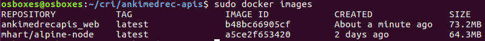
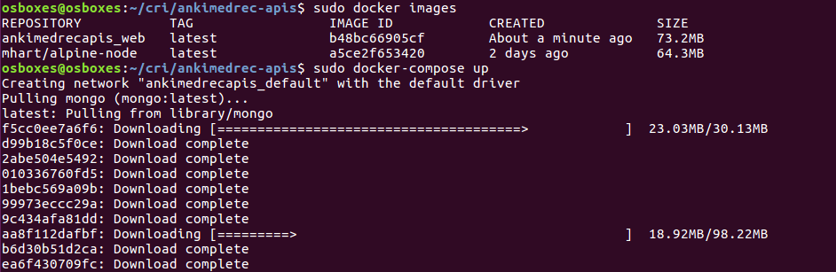

## Hands On Labs

- Oracle Code Sydney July 2017

### Build the Docker Image

This section contains instructions to build and run the MedRec APIs (Node.js and MongoDB) inside locally running Docker containers.

If you have the Node.js app and MongoDB running locally you will need to stop them.
Simply Ctl-C to kill the process running the Node.js app you started previously.
Commands to stop MongoDB will be located in different places depending on your install.
On Ubuntu 16.04 I ran the following;

``` sudo /etc/init.d/mongodb stop ```

Next change into the root folder of your project. 
For example.

``` cd /home/dave/myprojects/ankimedrec-apis ```

To list any running Docker containers using the following command.

``` docker ps ```


To list any existing Docker images using the following command.

``` docker images ```


Ensure docker-compose is installed

``` docker-compose --version ```


Now, build the docker image using the following command.

``` docker-compose build ```


Next, list the Docker images again to view the new image.

``` docker images ```



### Run the Docker Image

Next, run the docker containers using the following command.

``` docker-compose up ```

At the start you should see output generated similar to the following;



Further down you should see output generated similar to the following;


You may see the following errors if MongoDB and the Node application are still running locally due to port clash.


Determine the IP address to access your APIs running in the Docker container.
On Ununtu you can do a sudo /sbin/ifconfig to list the Ip address assigned to the Docker container and to the VM.
For instance in the following screenshot you will see the IP addresses assigned to my enp0s3 (10.0.0.3) and docker0 (172.17.0.1) interfaces.

From a broswer in my Ubuntu VM I could access using http://172.17.0.1:3000/ and from my Windows host I could use http://10.0.0.3:3000


Launch a browser on your browser and point it to http://yourIPaddress:3000


Interact with the SwaggerUI to do Get / Post operations and note the log output.


* No warranty expressed or implied.  Software is as is.
* [MIT License](http://www.opensource.org/licenses/mit-license.html)

<hr />
<center>
<a href="../../handsonlabs" class="btn" >Back to Hands On Lab Menu</a>
<center />
<hr />

