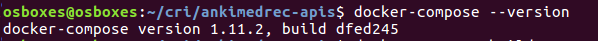
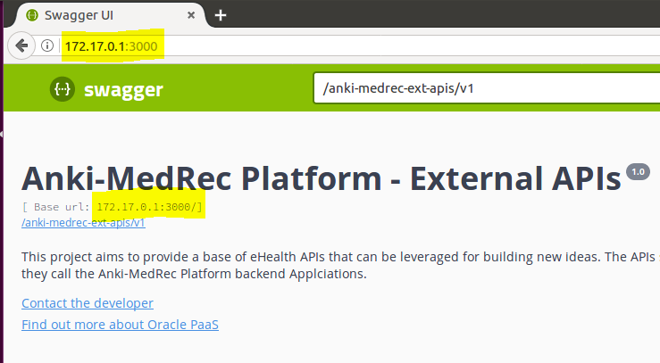

## Hands On Labs

- Oracle Code Sydney July 2017

### Build the Docker Image

This section contains instructions to build and run the MedRec APIs (Node.js and MongoDB) inside locally running Docker containers.

If you have the Node.js app and MongoDB running locally you will need to stop them.
Simply Ctl-C to kill the process running the Node.js app you started previously.
Commands to stop MongoDB will be located in different places depending on your install.
On Ubuntu 16.04 I ran the following;

``` sudo /etc/init.d/mongodb stop ```

Next change into the root folder of your project. 
For example.

``` cd /home/dave/myprojects/ankimedrec-apis ```

To list any running Docker containers using the following command.

``` sudo docker ps ```


To list any existing Docker images using the following command.

``` sudo docker images ```


Ensure docker-compose is installed

``` docker-compose --version ```



Now, build the docker image using the following command.

``` sudo docker-compose build ```


Next, list the Docker images again to view the new image.

``` sudo docker images ```


### Run the Docker Image

Next, run the docker containers using the following command.

``` sudo docker-compose up ```

At the start you should see output generated similar to the following:


*Be patient while it downloads the Mongo image from DockerHub.*

Further down you should see output generated similar to the following;


**Note: If you see the following error, it means that there are ports clashing due to MongoDB and the Node application are still running locally.**


Once the MedRec Application is running successfully, determine the IP address to access your APIs running in the Docker container.

On Linux, in another terminal do a **sudo /sbin/ifconfig** to list the IP address assigned to the Docker container and to the VM. For instance, in the following screenshot you will see the IP addresses assigned to my **enp0s3(10.0.0.1)** and **docker0 (172.17.0.1)** interfaces.

This means that from a broswer **inside my Ubuntu VM** I could access using **http://172.17.0.1:3000** and from outside the VM, in the **host machine**, I could use **http://10.0.0.1:3000**


Launch a browser and make sure that you can access the MedRec Swagger UI using either IP Address **http://IPaddress:3000**

This image is accessing the Swagger UI from within the Ubuntu VM:


While this one is accessing the Swagger UI from outside the VM, but within the Host Machine:


Interact with the SwaggerUI to do **GET / POST** operations and note the log output.


<br><br>

* No warranty expressed or implied.  Software is as is.
* [MIT License](http://www.opensource.org/licenses/mit-license.html)

<hr />
<center>
<a href="../../handsonlabs" class="btn" >Back to Hands On Lab Menu</a>
<center />
<hr />

