## Hands On Labs

- Oracle Code Sydney July 2017

### Explore the APIs via SwaggerUI

This section provides instructions to use the SwaggerUI.
Point your browser to localhost:3000

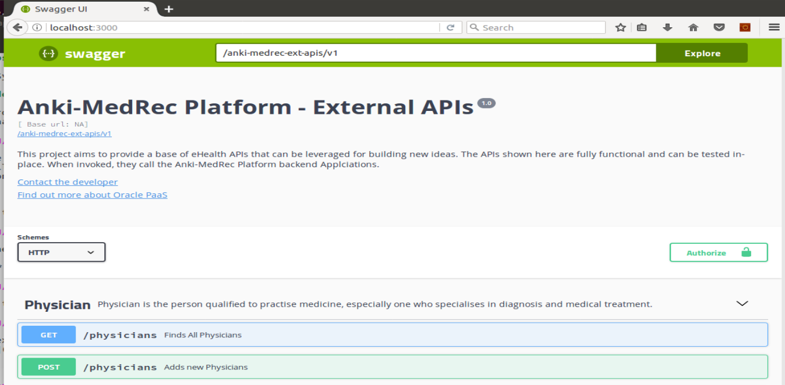

Under Physicians, click the GET button.

Click the "Try It Out" button

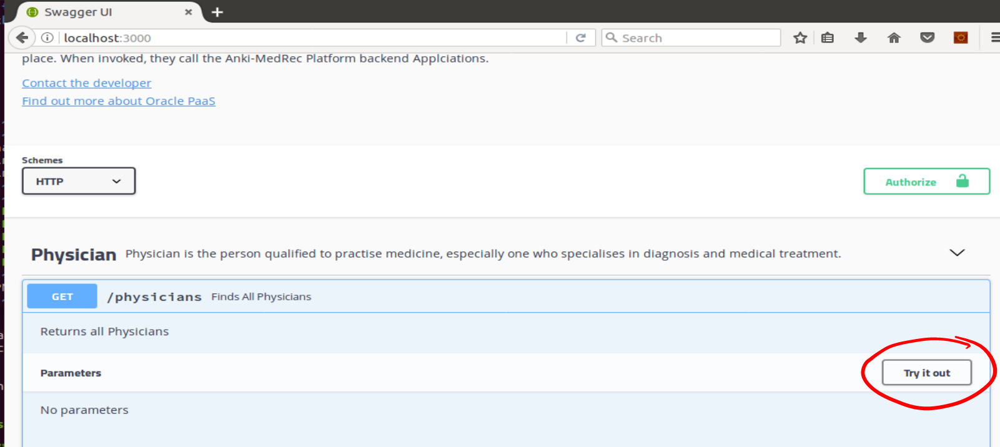

Click Execute button.

Since it is a new installation, the list of Physicians is going to be empty.

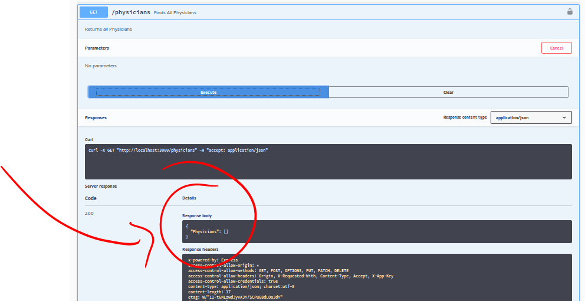

Let's add some physicians next.

Click the blue GET button to collapse it and then press POST.

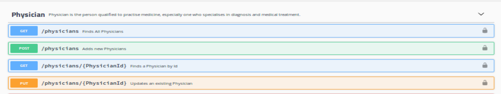

Note the example value - this is useful to copy/paste when using other tools such as Postman.
Click the "Try It Out" button 

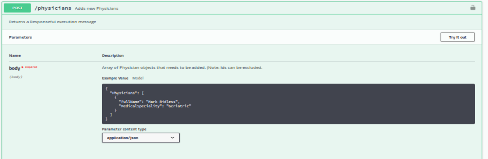

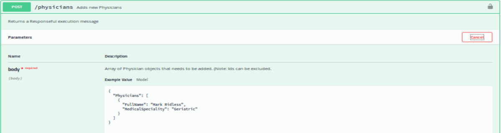

Edit the Physician data as desired

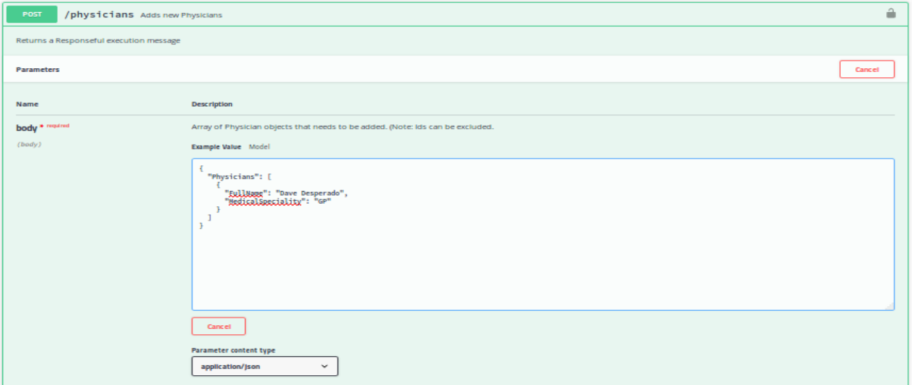

Click the Execute button

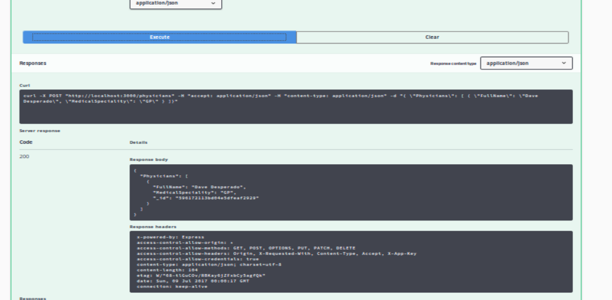

Collapse the POST operation by clicking on the POST button.

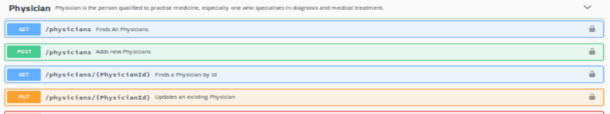

Do another GET operation 

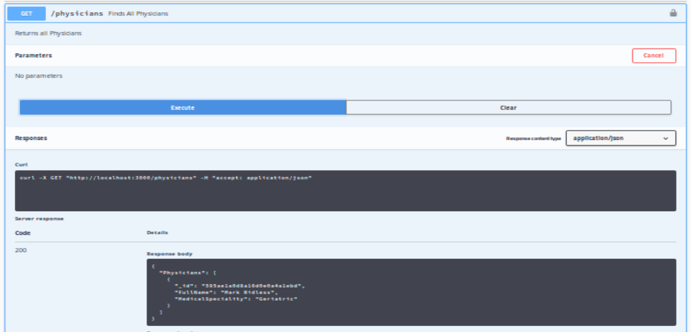

You should see the Physician data you added during the POST operation in the API response.

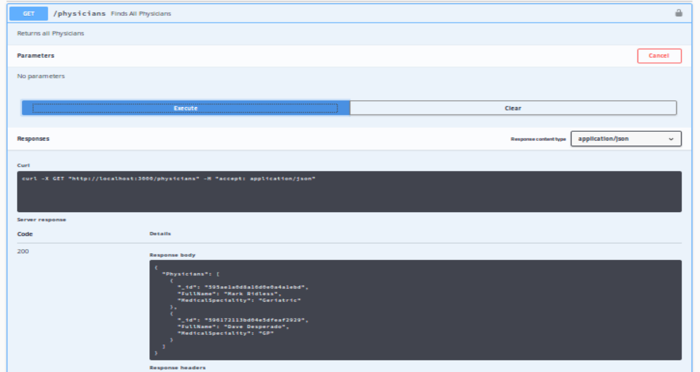

* No warranty expressed or implied.  Software is as is.
* [MIT License](http://www.opensource.org/licenses/mit-license.html)

<a href="../../handsonlabs" class="btn" >Back to Hands On Lab Menu</a>

