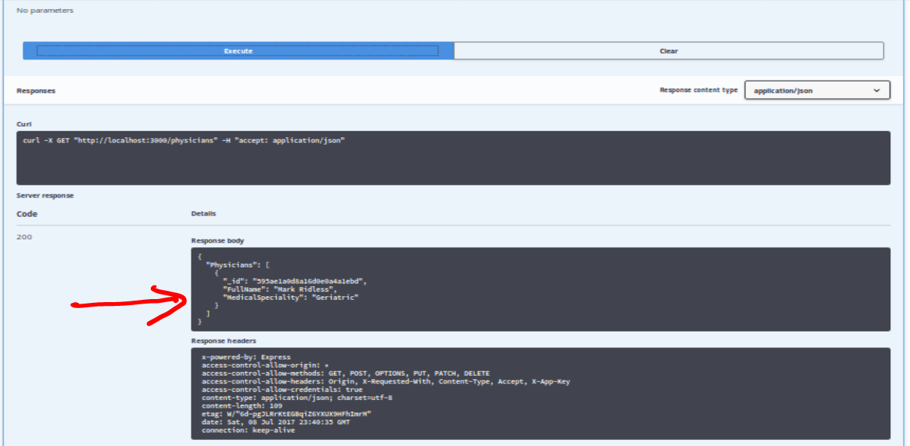

## Hands On Labs

- Oracle Code Sydney July 2017

### Explore the APIs via SwaggerUI

This section provides instructions to use the SwaggerUI.
Point your browser to localhost:3000

Under Physicians, click the Get button.

Click Try It Out button

Click Execute button

Post

Next 

Next

Next

Next 

Next

Next

Next

* No warranty expressed or implied.  Software is as is.
* [MIT License](http://www.opensource.org/licenses/mit-license.html)

<a href="../../handsonlabs" class="btn" >Back to Hands On Lab Menu</a>

