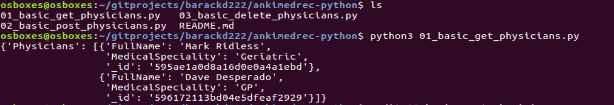
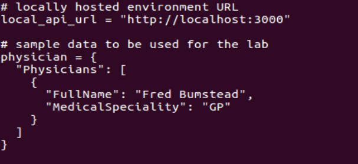
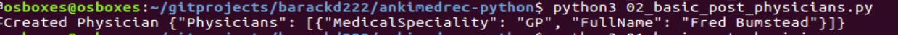
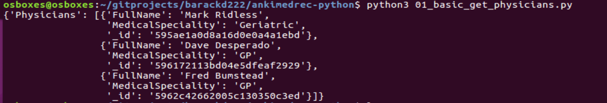
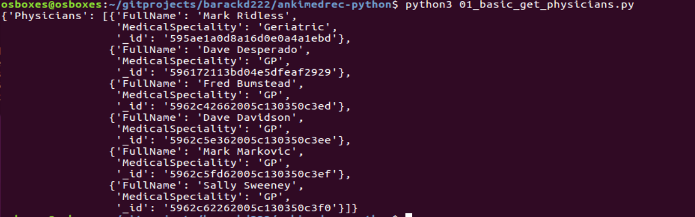
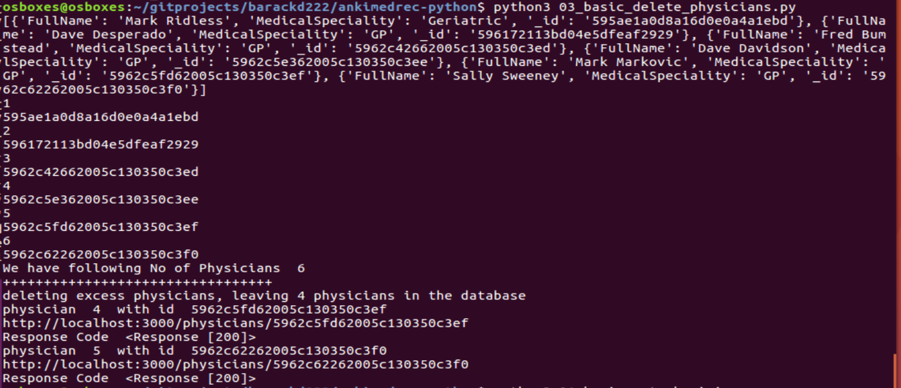
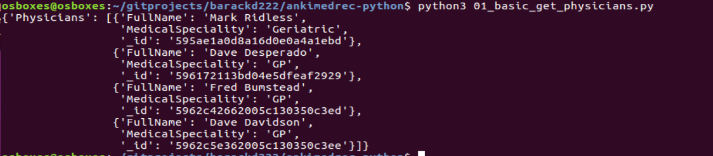

## Hands On Labs

- Oracle Code Sydney July 2017

### Explore the APIs using Python

This section will help you interact with the AnkiMedRec APIs using **python**.

Assumptions:
- You have already done a clone your fork of the **ankimedrec-python** project
- You have the APIs running locally
- you have a terminal session open and have changed directory in the root directory of the above project

First you will perform invoke a Get on the Physicians API. 

To do this, on Ubuntu execute the following commands - for Windows use **py** instead of **python3**.

```
python3 01_basic_get_physicians.py
```



Assuming that you had data already in the MongoDB you will have some data returned.
The file **02_basic_post_physicians.py** will allow us to specify the data for a Physician to support a POST operation. Prior to running this you will need to edit the file to specify your own sample data.




Once you have saved the file, execute the following command

```
python3 02_basic_post_physicians.py
```



Repeat the edit, save, execute steps to ensure that you have more than 4 Physicians in your MongoDB.





The third file **03_basic_delete_physicians.py** will be used to delete Physicians to leave only 4 in the database.

```
python3 03_basic_delete_physicians.py
```



Running **python3 01_basic_get_physicians.py** again will show that only 4 Physicians remain

```
python3 01_basic_get_physicians.py
```



Feel free to spend time playing with the Python code to make it do other interesting things that you want.


<br><br>

* No warranty expressed or implied.  Software is as is.
* [MIT License](http://www.opensource.org/licenses/mit-license.html)

<hr />
<center>
<a href="../../handsonlabs" class="btn" >Back to Hands On Lab Menu</a>
<center />
<hr />


