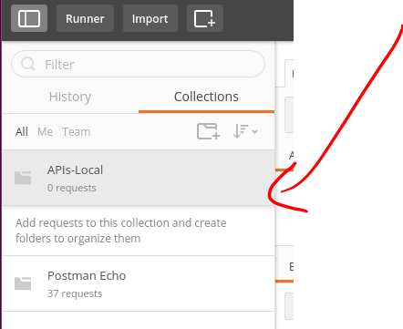
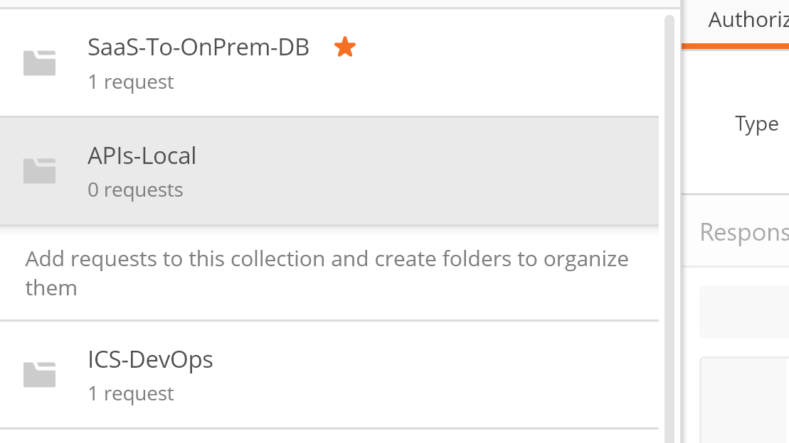
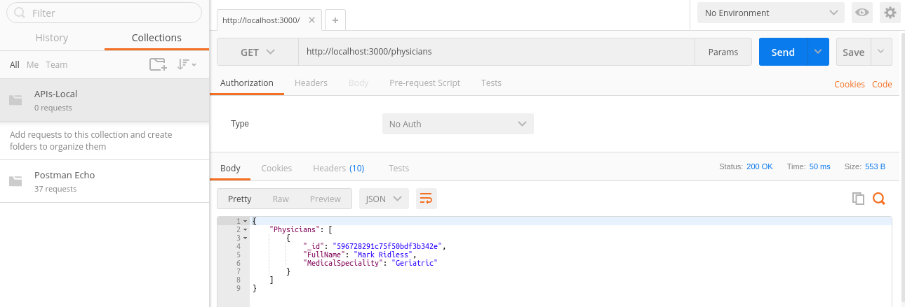
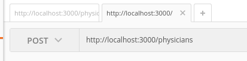
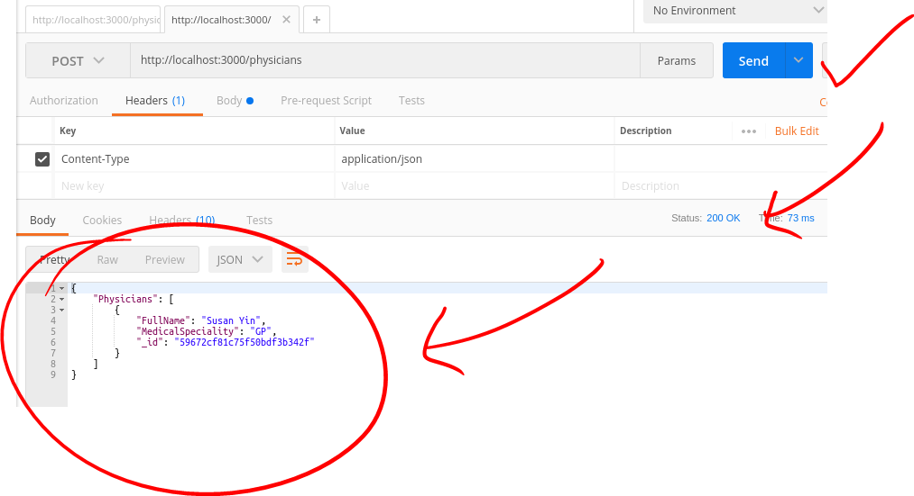

## Hands On Labs

- Oracle Code Sydney July 2017

### Explore the APIs using Postman

This section provides instructions to use the Postman client to access the AnkiMedRec APIs.
It is assumed that the Node.js application is running and accepting requests on localhost:3000.

Launch the Postman application


Create a collection 


Specify a name for the collection, eg, "APIs-Local" and click the Create button.


Click to select your new collection in the left pane.



Any REST requests (once defined) will appear under the collection when it is selected.



### Specify a GET Request

In the right pane, we can now specify our API request in the space immediately to the right of the GET button..
If you are using Postman on your host and accessing the APIs running in your VM thne you will need to determne the IP address of the VM and use that otherwise you can simply enter the following ``` http://localhost:3000/physicians``` 


Select the operation from the pull down (GET, POST etc). For our initial exercise we will do a GET.


Click the Send button



You should see a list of Physicians.

Click the Save button (top right) to save it into your collection.
Choose the name of your collection from the dropdown list and press the Save button.


You should see your request under your collection in the left pane.


### Specify a POST Request

To specify a POST request to add a physicians do the following;

Click the GET button and select POST from the dropdown list.



Click the Body tab, and select the Raw radio button.


Click the Body tab, and select the Raw radio button.
In order to specify the payload, we can revisit the SwaggerUI for the Post operation.
The SwaggerUI provides us with an example payload that we can copy.


Back in Postman paste the payload copied from SwaggerUI into the Body as per the following screenshot.
Modify the Physicians name to suit you.


We now need to specify a Header to specify that our Content-Type is application/json format.
Click the Headers tab.
Under the title "Key" start typing Content and select Content-Type from the list that appears.


Adjacent to the Content-Type Header specify "application/json"



Now save the POST Request into the your collection.
To test the POST Request , press Send.

* No warranty expressed or implied.  Software is as is.
* [MIT License](http://www.opensource.org/licenses/mit-license.html)

<hr />
<center>
<a href="../../handsonlabs" class="btn" >Back to Hands On Lab Menu</a>
<center />
<hr />

