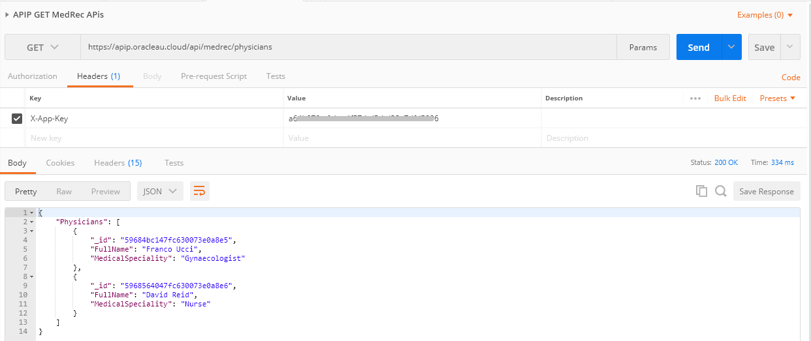
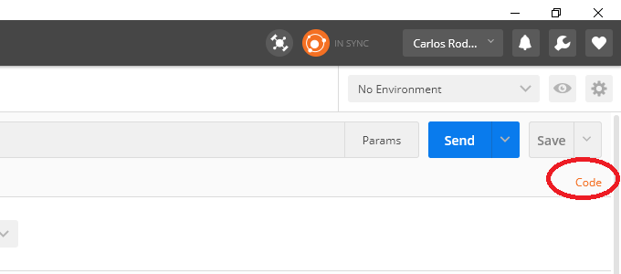
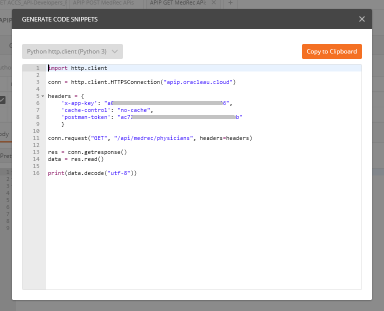
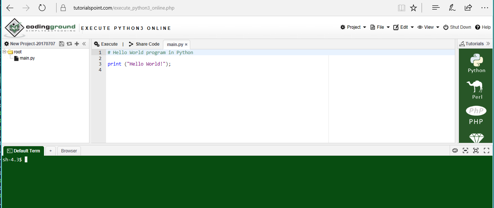
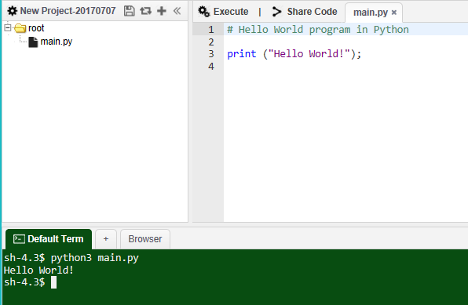

# Explore the APIs using an Online Python Service

One of the nice thing about modern APIs, is that we can choose our favourite programming language to access them. In this section of the handson lab you will invoke the MedRec APIs with multiple types of programming languages (python, nodejs, go, etc.)

## Get the code snippet from Postman
If you have been following through the handson labs you will already have a Postman collection with your Get and Post operations to access the APIs already saved. 
Perform the Get operation to prove it is still available and responsive.

 

 

Click on the Code link (it is located just under the Save button). 

In the top left of the dialog window you can select the grey button (top left) and choose the programming language that suits your needs.

For the purpose of this lab, let's choose **Python - http.client(Python 3)**

 

 

Copy the code snippet, as we are going to execute it in the next step.

## Paste and run the Get Physicians code snippet into an online Python service
 
Once you copied the Python snippet then you can run it wherever you want. 
There are several options that you may consider:

1. Run it in your own existing Python environment
2. Install Python locally and run it there 
3. Download a Python docker image from Docker hub
4. For simple scenarios such as what we want to cover, you could simply use an Online browser-based IDE offering such as what [TutorialPoints](http://www.tutorialspoint.com/codingground.htm) offer, as per the steps below:

 

- Point your browser to [TutorialsPoint](http://www.tutorialspoint.com/codingground.htm) and search for Python3 IDE. Then click on it:

 

 

You should see a **Hello World** example waiting for you. 
Press the **Execute** Button to see **Hello World** returned into the console window below the code editor.

Notice in the console window that the command being executed is as follows:

*python main.py*

 

 

- Next create a new file within the pre-established project.

- Click the '+' symbol in the Project pane (left of the code snippet) to create a new file.
- Right Click on the new file to rename it - **GetPysicians.py**
- Now click on the tab for the GetPhsicians.py file and paste your clipboard contents that you copied from Postman into the code editor. 
- In the console window type the following:

``python3 GetPhysicians.py``

You should see the Physicians you added earlier returned.

 
## Repeat for Post Physicians 
 

- In Postman execute a request to **POST** a new Physician.
- Repeat the step to copy the code snippet.
- Create a new file called **PostPhysicians.py** in the project on tutorialspoint website.
- Execute the following command:

``python3 PostPhysicians.py``

- Observe the response
- Now in the console window type the following:

``python3 GetPhysicians.py``

- You should see the Physicians you added earlier plus the one you just added.

Feel free to modify the code snippet and play building your own logic.

 

For more details, feel free to watch the following video:

<iframe width="600" height="350" src="https://www.youtube.com/embed/c56tURvybYg?rel=0" frameborder="0" allowfullscreen></iframe>

  

* No warranty expressed or implied.  Software is as is.
* [MIT License](http://www.opensource.org/licenses/mit-license.html)
 

<a href="../../handsonlabs" class="btn" >Back to Hands On Lab Menu</a>

