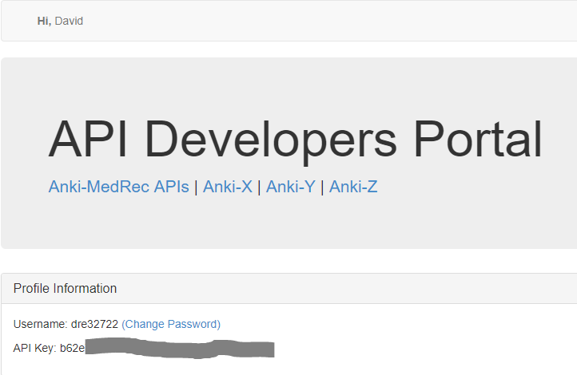
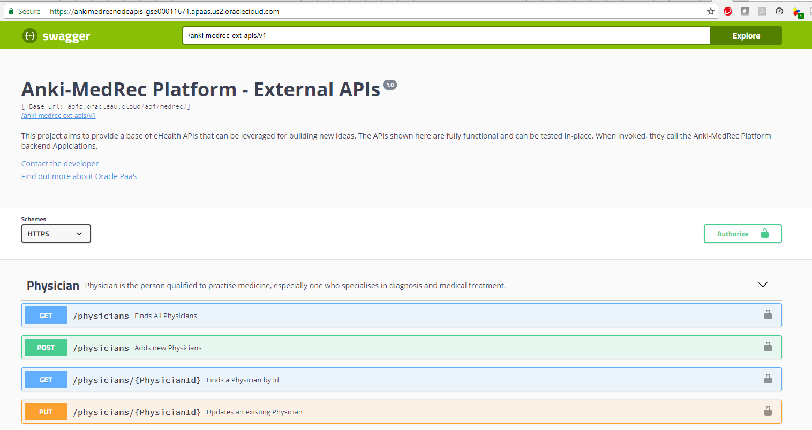
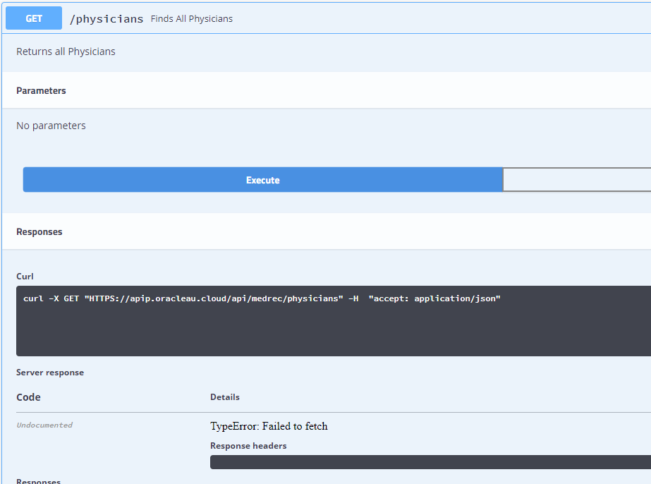
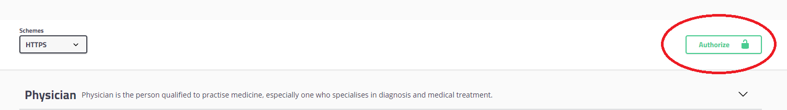
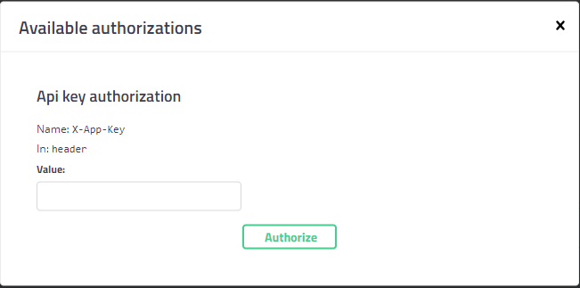
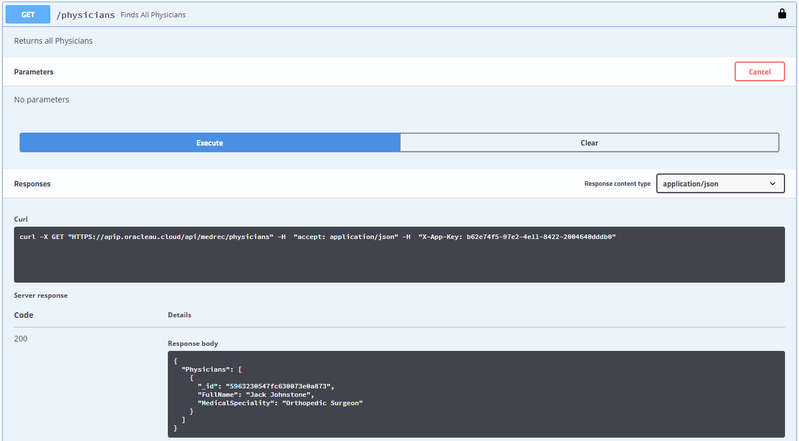

## Hands On Labs

- Oracle Code Sydney July 2017

### Explore the Secured APIs using SwaggerUI

This section provides instructions to use the Postman client to access the AnkiMedRec APIs running on the Oracle Application Container Cloud Service (ACCS). The APIs are secured using the API Platform Cloud Service.

** It is assumed that you have already registered as a developer and have a valid API key.**

Now launch the Swagger application that is running on ACCS.Point your browser to the following;

[Access Swagger on ACCS](https://ankimedrecnodeapis-gse00011671.apaas.us2.oraclecloud.com/)

Notice that the padlock symbol (far right) shows as unlocked.

Attempt to execute a GET Request for Physicians.
Notice the TypeError: Failed to Fetch error message has been returned.
And we agree that it should be handled better !!

Click the Authorize button to the far right of the scheme (HTTPS) above Physicians.

Paste your API Key into the Value field and click the Authorize button.

Your screen should look like the following. Click the X to close the dialog window.

Notice that the padlock symbols are in a locked position.

Execute another GET Request for Physicians

You should see that the request was allowed and Physician data is returned (assuming it already existed).

* No warranty expressed or implied.  Software is as is.
* [MIT License](http://www.opensource.org/licenses/mit-license.html)

<a href="../../handsonlabs" class="btn" >Back to Hands On Lab Menu</a>

