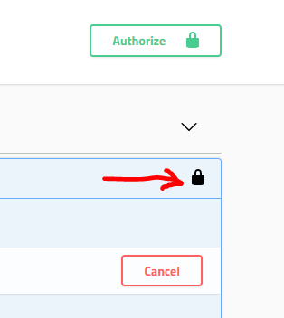

## Hands On Labs

- Oracle Code Sydney July 2017

### Explore the Secured APIs using SwaggerUI

This section provides instructions to use the Postman client to access the AnkiMedRec APIs running on the Oracle Application Container Cloud Service (ACCS). The APIs are secured using the API Platform Cloud Service.

**It is assumed that you have already registered as a developer and have a valid API key**

Notice the **API-Key** that is assigned to you. You will need it in the following steps.

Open the Swagger UI application that is running in ACCS. For this click on the link **Anki-MedRec APIs** as indicated in the image below:

The Swagger UI for MedRec APIs will open in a new window

Notice that the padlock symbol (far right) shows as unlocked.

Attempt to execute a GET Request for Physicians.
Notice the TypeError: **Failed to Fetch error message has been returned.**

This is because the APIs are still **unauthorised** and the **API Gateway** is enforcing **a valid API-Key** to get access to all of these MedRec APIs. 

Click the **Authorize** button to the far right of the scheme (HTTPS) above Physicians.

Paste your **API Key** into the Value field and click the **Authorize** button.

Your screen should look like the following. Click the X to close the dialog window.

Notice that the padlock symbols are in a locked position.

Execute another **GET** Request for **Physicians**

You should see that the request was allowed and Physician data is returned (or an empty list assuming no data exists yet).

Feel free to **POST** some new **Physicians** and **Patients** and **GET** those new records back successfully.

  

* No warranty expressed or implied.  Software is as is.
* [MIT License](http://www.opensource.org/licenses/mit-license.html)

<a href="../../handsonlabs" class="btn" >Back to Hands On Lab Menu</a>

