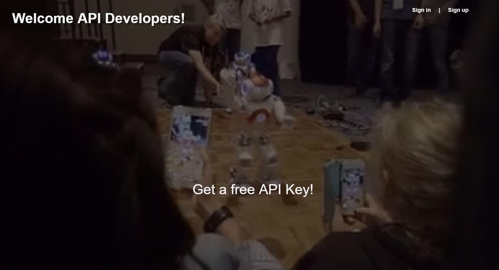
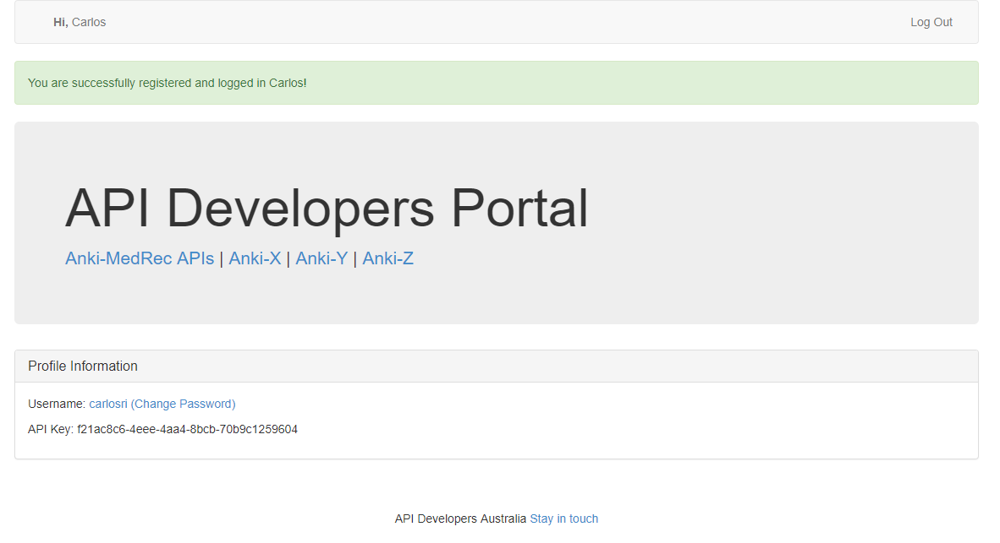
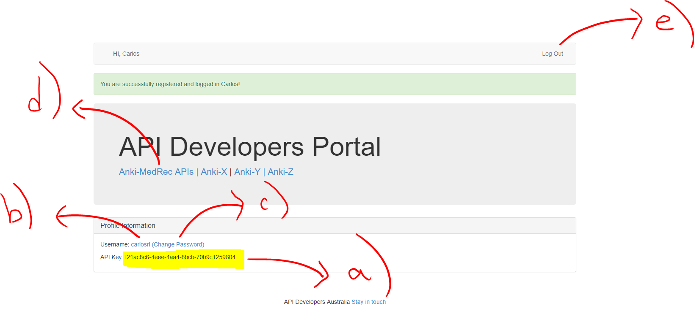

## Hands On Labs

- Oracle Code Sydney July 2017

### Register as a developer to get an API Key

This section provides instructions on how to self-register at [http://developers.oracleau.cloud](http://developers.oracleau.cloud) and obtain an API-Key that then can be used to authorise your access to the Anki-MedRec APIs hosted in the Oracle Public Cloud.

1. The first think that you have to do is to go: [http://developers.oracleau.cloud](http://developers.oracleau.cloud)

2. Then click on the **Sign up** link at the top or on the **Get a free API Key!** link at the middle centre of the landing page.

3. Enter your details in the Registration form.

**Be careful** to enter your mobile/cellphone starting with the **country code**, e.g. **61**414592612

When you are done, click on the **Sign up** button.

4. You will be granted access to the **API Developers Portal**.

Important links to notice:

- **a)** This is your secured **API-Key**, don't share it with anyone as it authenticates and authorises your account. You will need it to get access to the APIs in the following sections. 
- **b)** Click on your **username** to modify your contact details.
- **c)** Click on **Change Password** link to change your password.
- **d)** Click on the **Anki-MedRec APIs** link to get access to its Swagger UI (more details in the next section).
- **e)** Click **Log Out** to sign out and terminate your session.

 

For more details, feel free to watch the following video:

<iframe width="600" height="350" src="https://www.youtube.com/embed/9ra_guIjce8?rel=0" frameborder="0" allowfullscreen></iframe>

  

* No warranty expressed or implied.  Software is as is.
* [MIT License](http://www.opensource.org/licenses/mit-license.html)

<a href="../../handsonlabs" class="btn" >Back to Hands On Lab Menu</a>

