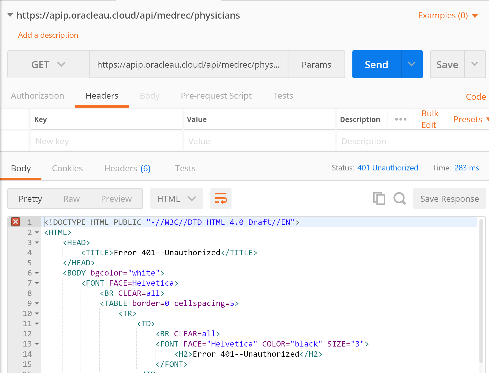
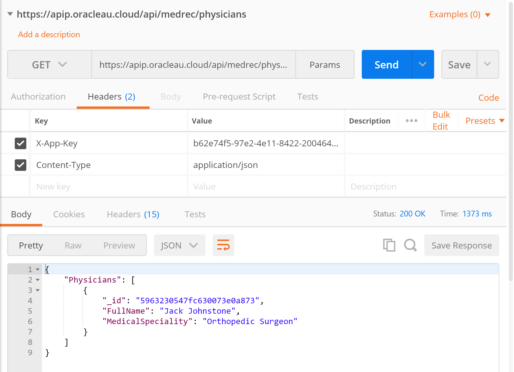

## Hands On Labs

- Oracle Code Sydney July 2017

### Explore the Secured APIs with your API Key using Postman

This section provides instructions to use the Postman client to access the AnkiMedRec APIs running on the Oracle Cloud and secured using the API Platform Cloud Service.
It builds upon the previous lab where you explored the APIs using Postman.

Launch the Postman application and create a new collection with a meaningful name eg APIs-Remote

Add a GET request to the collection using the following URL

```https://apip.oracleau.cloud/api/medrec/physicians```

Press Send to execute the GET Request.
Notice that you get a **HTTP 401 - Unauthorized** error message returned.



Now specify two headers as follows;
```X-App-Key``` with a value of ```yourAPIKeyValue```
```Content-Type``` with a value of ```application/json```
Press Send
The GET Request should be accepted and Physician data returned.



Save the Request Information into your Collection.

Repeat the above steps but this time for a POST request.
Verify that you POST  Request was successful by repeating the GET request.
Save your request into your collection.

* No warranty expressed or implied.  Software is as is.
* [MIT License](http://www.opensource.org/licenses/mit-license.html)

<hr />
<center>
<a href="../../handsonlabs" class="btn" >Back to Hands On Lab Menu</a>
<center />
<hr />

