## Hands On Labs

- Oracle Code Sydney July 2017

### Fork The MedRecAPI Git Repository into your GitHub account

This section provides instructions to fork the Git Repository for the ankimecrec-apis project.
Forking a repository allows you to make a copy of an existing repository and you can make changes in your own space without impacting the original project. 

Point your browser to [GitHub.com](https://github.com) 

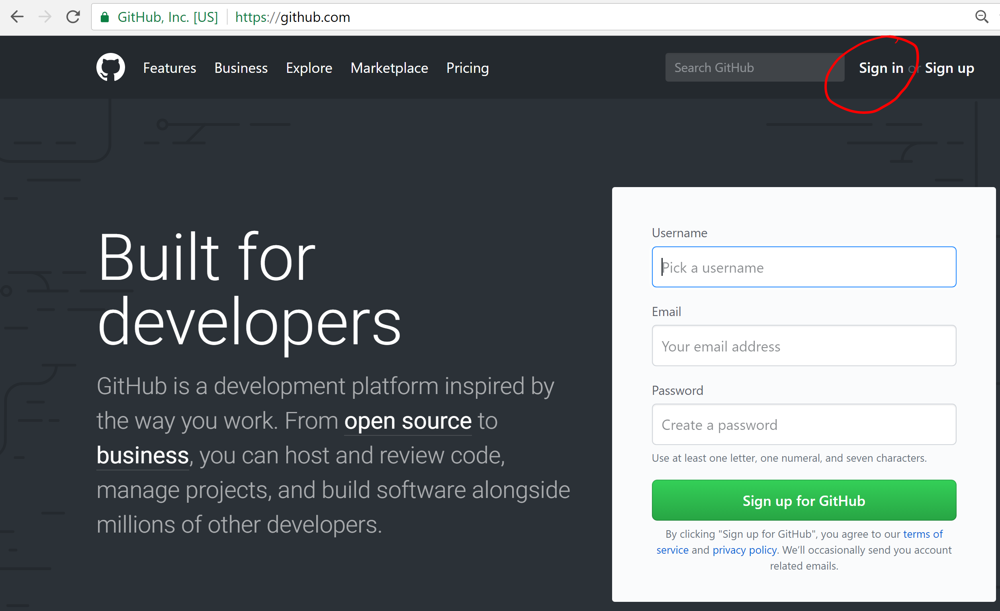

Click Sign In and enter your credentials.

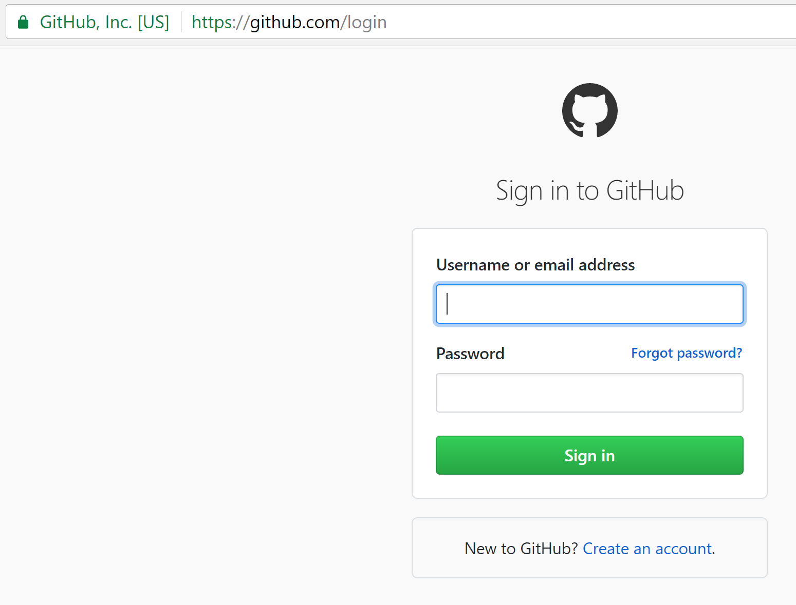

With your cursor in the repository search bar (circled in red)

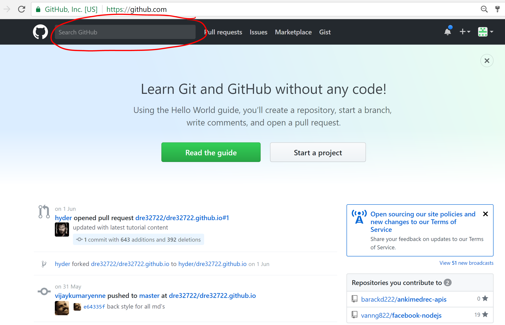

Enter the following search criteria: **barackd222/ankimedrec-apis** and press Enter.

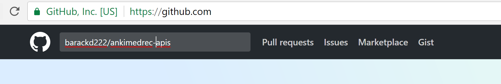

You should see that the repository has been found. 
Now click the hyperlink to navigate to the barackd222/ankimedrec-apis repository

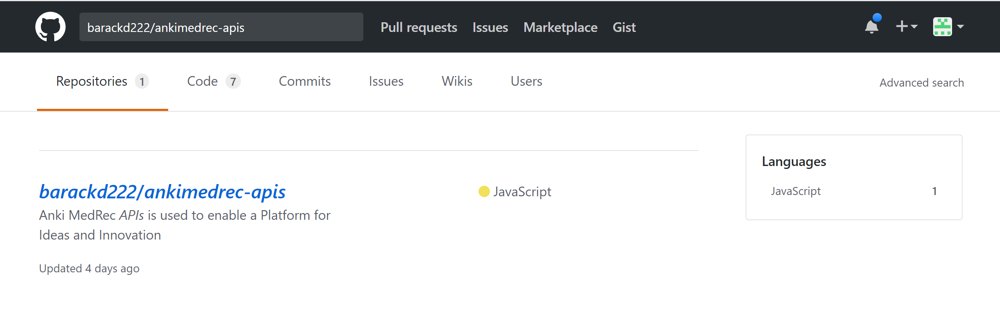

Click the fork button (circled in red) to create a copy of the ankimedrec-apis repository in your account.

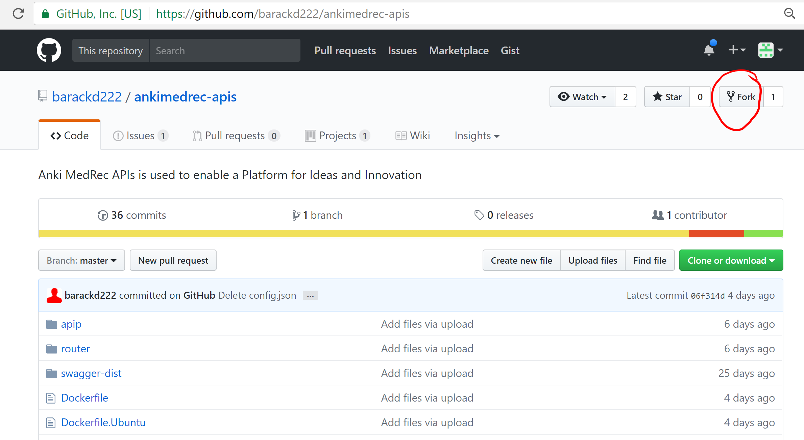

Enter https://github.com/yourusername into the browser to navigate to your home page.
Navigate to the repository just created when you used the git fork.
If you have a lot of repositories you may have to click the *repositories* link.

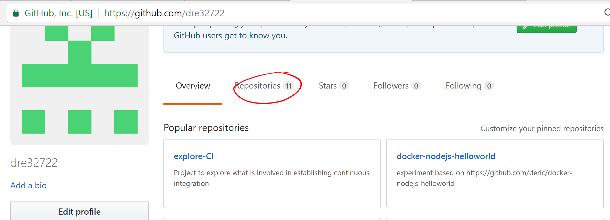

Once you find the repository click the hyperlink *ankimedrec-apis*

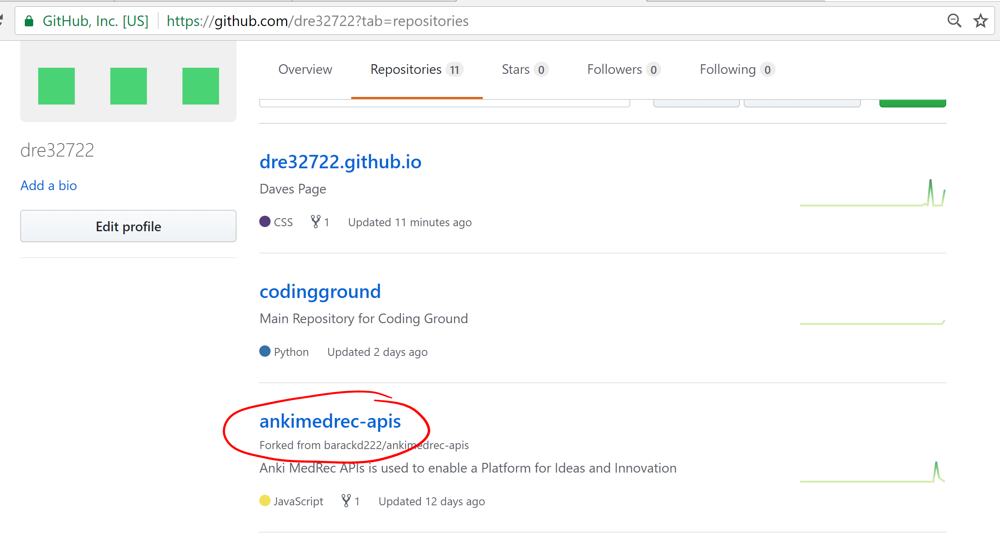

Now click on the Clone or Download button.

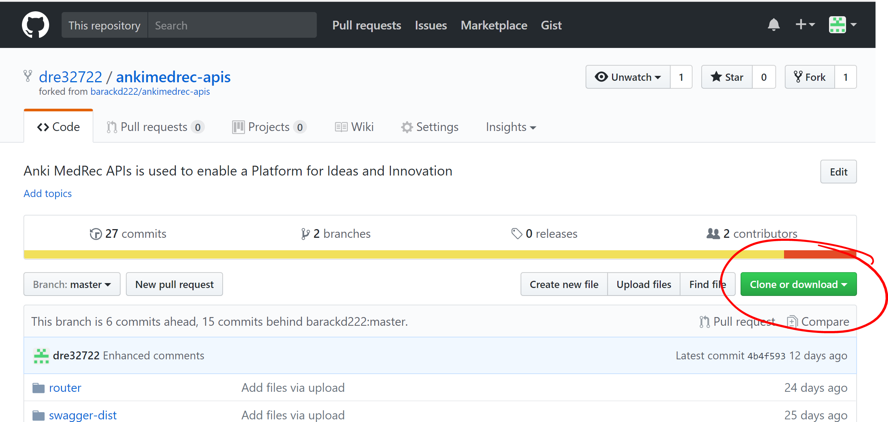

You will now see the URL that points to your git repository.
Copy the link as you will paste into your git clone command in the next step.

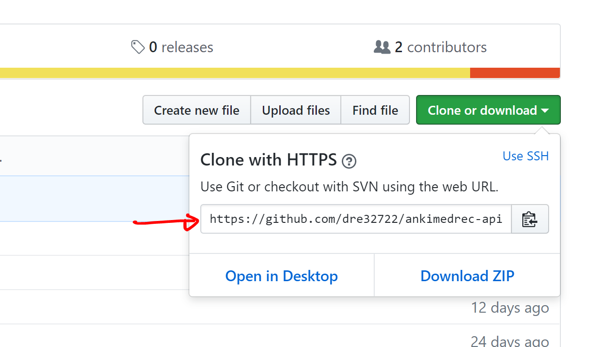

Next change into a directory on your laptop where you want to pull down the github project into (eg **/home/dave/myprojects**).

*cd /home/foo/gitprojects*

*git clone https://github.com/yourusername/ankimedrec-apis.git*

You should now the see a sub-directory created with the files cloned down from your github repository.

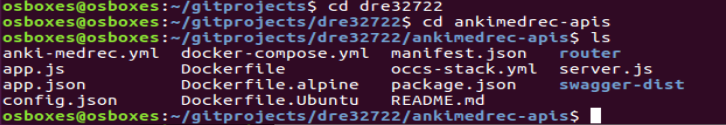

* No warranty expressed or implied.  Software is as is.
* [MIT License](http://www.opensource.org/licenses/mit-license.html)

<a href="../../handsonlabs" class="btn" >Back to Hands On Lab Menu</a>

