## Hands On Labs

- Oracle Code Sydney July 2017

### Install the MecRec Node.js app on ACCS

This section provides instructions to deploy the MedRec APIs to an Oracle Application Container Cloud Sevrice (ACCS) Instance.

It is assumed that the MongoDB on IaaS lab has been successfully completed.

#### Change the config.js file to point to the remote MongoDB

Before you deploy the MedRec Node.js application onto ACCS, you can run it locally to make sure you can successfully access the remote MongoDB instance. To achieve this you will need to do the following;

Edit the config.js file using your favourite editor.

```
gedit config.js
```

Make changes to the line referencing MONGODB_SERVER and change it from localhost to your MongoDB IP address.

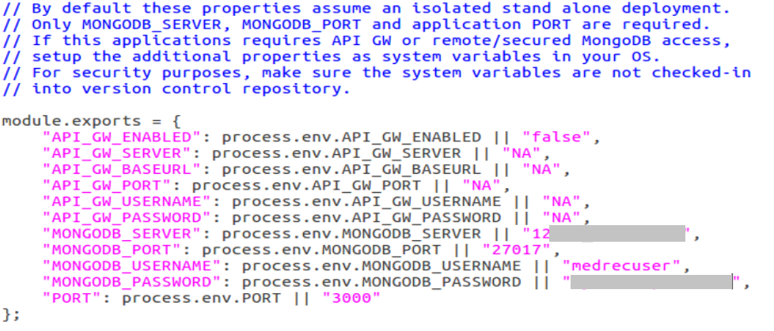

Save the changes made to config.js and exit your edit session.

You are now ready to run the app locally and establish a connection to the remote MongoDB.

#### Run the app locally to prove connectivity

In your terminal window enter the following;

```
node app.js
```

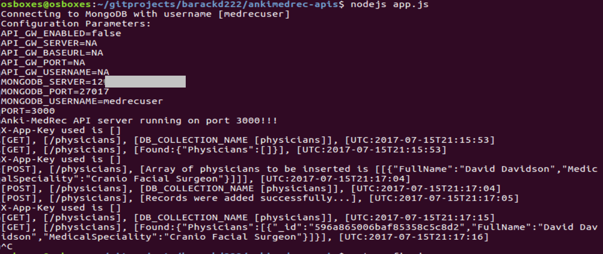

Now launch a browser and point it to localhost:3000.
In the SwaggerUI , do a GET of Physicians.
You should see an empty array.
Do a POST of Physicians, and then another GET.

If you want to check via Putty to make sure the data is being written to the remote database.
Open a Putty session.
Change to the directory where the Mongodb data files are stored.

```
cd /home/bitnami/stack/mongodb/data/db
```
List the directory contents
```
ls -las
```

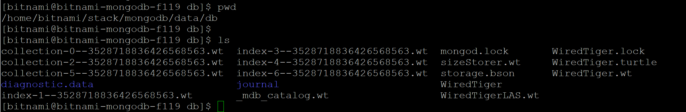

Now interact with your SwaggerUI in the browser and observe the file changes in the directory.
You can also cat the file contents and see some of your Physicians data as well as some non printable characters.

List the directory contents. I found a recently modified .wt file and used the **cat** command to explore the contents.

```
ls -las
```

You will need to specify your collection id.

```
cat collection-0-6148420097591741311.wt
```

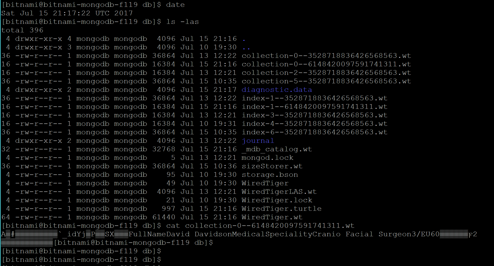

For your server application to run properly on Oracle Application Container Cloud Service, it must comply with the following requirements:
- The application must be bundled in a .zip file.
- In addition to the server.js file, the .zip file must contain a manifest.json file that specifies what command Oracle Application Container Cloud Service should run.
- Your application must listen to requests on a port provided by the PORT environment variable. Oracle Application Container Cloud uses this port to redirect requests made to your application.

From the root directory of your project create a zip file containing your application using the following command.

```
zip -r myankimedrec-apis.zip .
```

#### Create an application container on ACCS

To deploy the application to Oracle Application Container Cloud Service you use the .zip file that you created in the previous section. You use the administration console to upload and deploy the application.

Log in to Oracle Application Container Cloud Service at http://cloud.oracle.com/. Enter the user name, password and identity domain for your account.

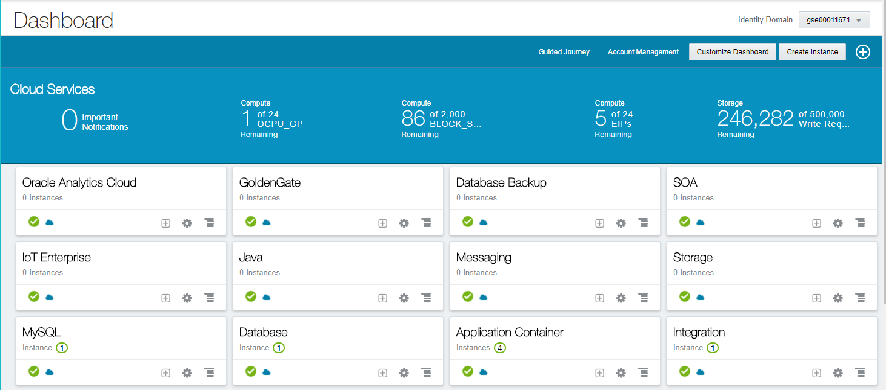

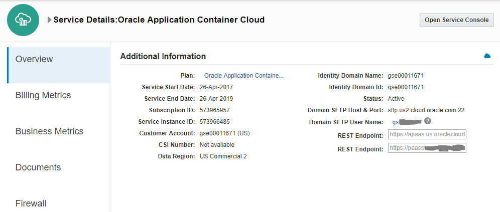

Click Create Application 

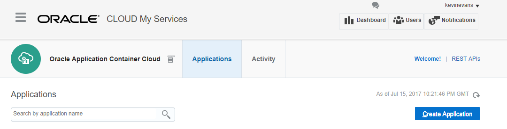

Choose Node.

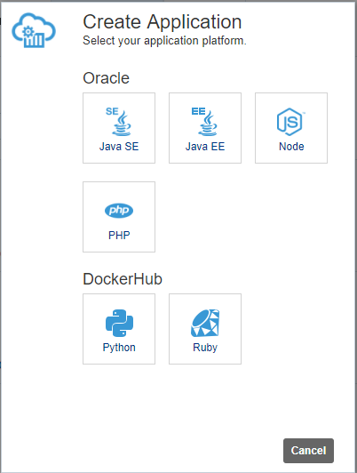

Enter a name for your application and select Upload application archive.

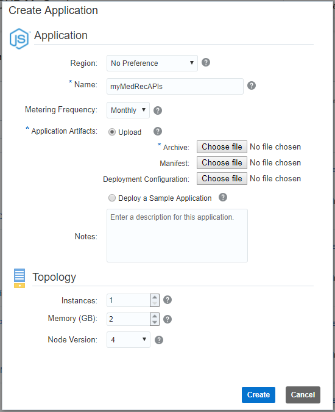

Click Browse, locate the zip file that you created previously; 
Select it and click Open.

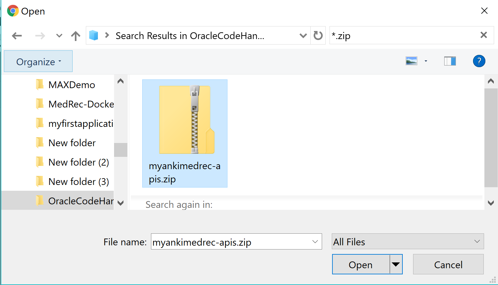

Enter any additional details for the application such as number of instances and amount of memory per instance.
I used an instance count of 1.
Click Create.

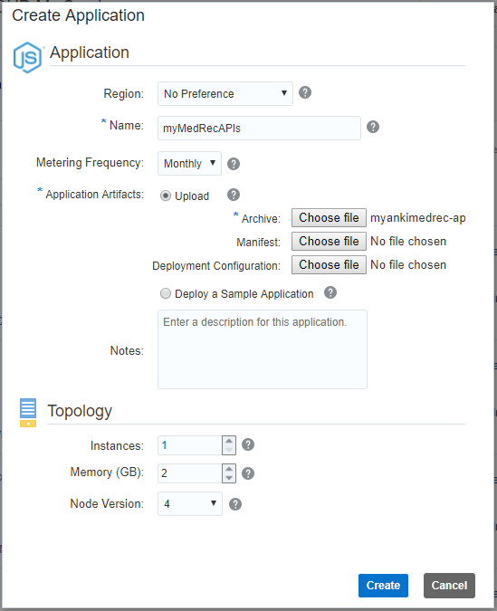

The application begins deploying. Click OK.

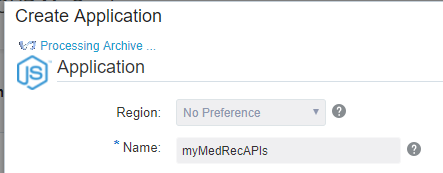

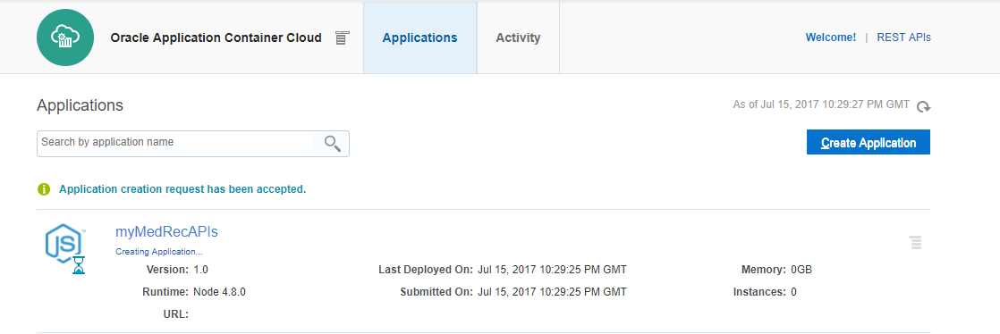

Copy the URL of your deployed application from the Oracle Application Container Cloud Service home page. 
You'll use it in a browser to launch the Swagger app.

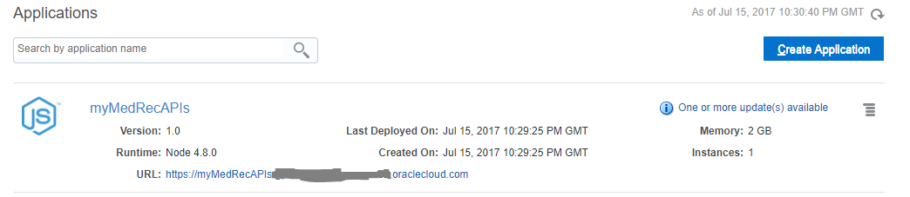

Click the Hamburger menu on the far right associated with your application to view additional actions.
Note: The application should be automatically started, otherwise use the Start Application action from the menu.

Choose Open Application option.

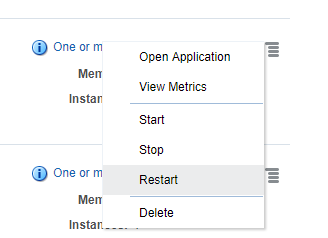

You should see that your browser is launched and the SwaggerUI is ready for your GET / POST requests.
Please note that you will need to set the default scheme in the SwaggerUI to **HTTPS**.

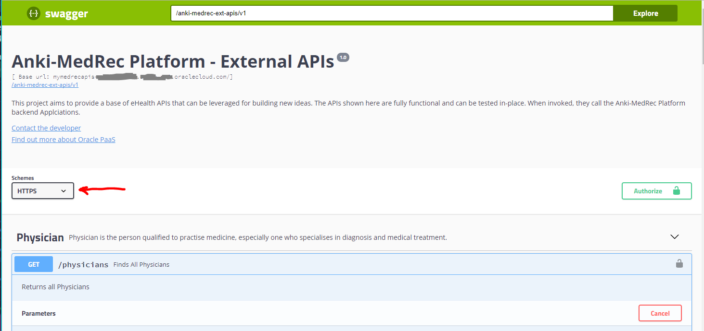

If you leave it as **HTTP** you will see an error message as per the following screenshot.

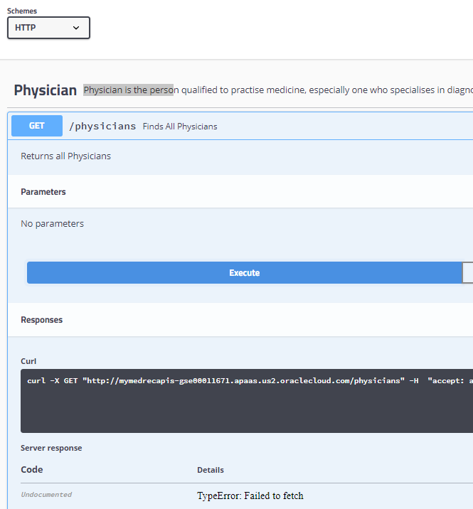

* No warranty expressed or implied.  Software is as is.
* [MIT License](http://www.opensource.org/licenses/mit-license.html)

<hr />
<center>
<a href="../../handsonlabs" class="btn" >Back to Hands On Lab Menu</a>
<center />
<hr />


