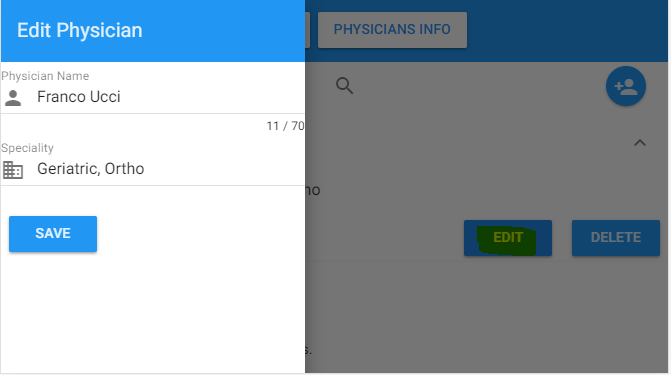

## Hands On Labs

- Oracle Code Sydney July 2017

#### Explore the APIs using a pre-built web application

In addition to the REST clients we have used to access our APIs we have put together a sample web application using a progressive framework called Vue.js. For more information about the UI framework visit [Vue](https://vuejs.org). There are two parts of this lab. You can either execute the webapp against the APIs available on API Platform or execute the webapp against the APIs deployed on your local machine. Navigate to the section of your interest.

### Fork the medrecapp project
Fork the sample medrec app repository from github - https://github.com/vijaykumaryenne/medrecapp in to your Github Account.
Clone the project to your local machine.

### Pre-Requisites
Please make sure the following are available on your local machine before starting the app.
1. Node.js is installed verion 6+
2. Access to the internet. (The app uses Google's material design CSS and Icons. It is recommended to have an active internet access)
3. Notepad or Notepad ++ or Atom editor is installed.
4. Chrome is installed.

### Run the Vue.js app against the APIs on API Platform
<br>
1. Register for the Medrec APIs as discussed in the earlier labs and copy the API Key once registration is successful.

2. Navigate to the cloned repository and open the http-common.js file located under Medrecapp>src> in your favourite editor (Notepad or Atom or Notepad++)


3. Modify the X-APP-KEY value (XXXXXXXXXX) to the api key copied from step 1 and save the file.


4. The webapplication uses port 3000. If the port is already being used you can allocate a new port to the webapp. Navigate to Medrecapp>config>index.js Change the port.


5. Open command prompt or a terminal window, navigate the cloned medrecapp repository and execute the below commands

``` bash
$ npm install
# This command is going to install the dependencies for the application. This will take a while to install all the required node libraries.
$ npm run dev
# This command is going serve the web application at localhost:3000
```


6. The application would now open in the default browser. To access the web app in chrome http://localhost:3000


7. Click on PHYSICIAN INFO Tab that is going to invoke the Physicians API and display the Physician Details.


8. Click on Add Physician to Add a new Physician details.This action opens up a new Add screen on the top left of the browser. 


Key in the Physician Details and hit save.

9. Expand the List and Click on Edit to edit an existing Physician Entry. This action will open up a screen on the top left of the browser window. Edit the details and hit save.



10. Try the Delete Functionality.

<br>

### Run the Vue.js app against your locally running APIs
<br>
1. Navigate to the cloned repository and open the http-common.js file located under Medrecapp>src> in your favourite editor (Notepad or Atom or Notepad++)


2. Change the baseurl to local address : http://localhost:3000

3. Remove the 'X-App-Key' header tag and save the file. Your file should like below:


4. The webapplication uses port 3000. If the port is already being used you can allocate a new port to the webapp. Navigate to Medrecapp>config>index.js Change the port.


5. Open command prompt or a terminal window, navigate the cloned medrecapp repository and execute the below commands

``` bash
$ npm install
# This command is going to install the dependencies for the application. This will take a while to install all the required node libraries.
$ npm run dev
# This command is going serve the web application at localhost:3000
```
6. The application would now open in the default browser. To access the web app in chrome http://localhost:3000


7. Click on PHYSICIAN INFO Tab that is going to invoke the Physicians API and display the Physician Details.


8. Click on Add Physician to Add a new Physician details.This action opens up a new Add screen on the top left of the browser. 


Key in the Physician Details and hit save.

9. Expand the List and Click on Edit to edit an existing Physician Entry. This action will open up a screen on the top left of the browser window. Edit the details and hit save.


10. Try the Delete Functionality.

* No warranty expressed or implied.  Software is as is.
* [MIT License](http://www.opensource.org/licenses/mit-license.html)
<br>
<hr />
<center>
<a href="../../handsonlabs" class="btn" >Back to Hands On Lab Menu</a>
<center/>
<hr />

