## Hands On Labs

- Oracle Code Sydney July 2017

### Provision MongoDB on Oracle IaaS

This section provides instructions to provision a pre-packaged application image provided by Bitnami (with MongoDB pre-installed) on the Oracle Infrastructure As A Service (IaaS).

Bitnami provides pre-packaged application images for Oracle Cloud Platform servers, so that you can get productive with your new server immediately. You can access and launch these images in two ways: 
1. through the free Bitnami Launchpad for Oracle Cloud Platform, which gives you an intuitive Web-based dashboard to create and manage your Oracle Cloud Platform servers, or 
2. through the Oracle Cloud Marketplace, Oracle's digital platform for software applications.

For the Hands On Lab purposes I recommend you use the Bitnami Launchpad for Oracle Cloud as it is a little easier. 

Before you start the lab you will need to [sign-up for a Bitnami account (action Steps 1 and 2 only)](https://docs.bitnami.com/oracle/get-started-launchpad/#step-1-register-with-bitnami)

With the Bitnami Sign-Up process completed, login to your Bitnami account (if you're not already logged in).
Point your browser to the [Bitnami Launchpad for Oracle Cloud Platform](https://oracle.bitnami.com/).

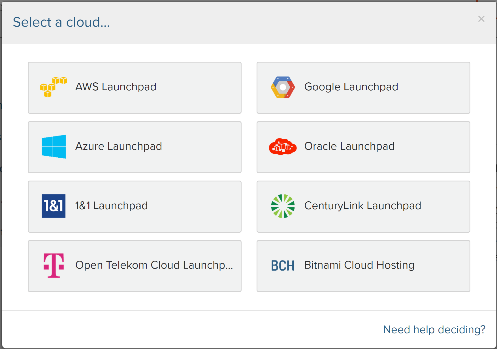

Select the "Sign in with Bitnami" link in the top right corner.

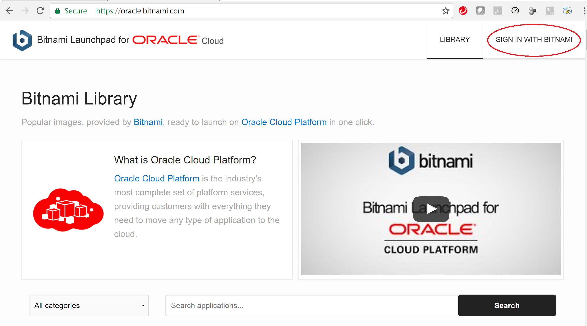

You should now be successfully authenticated from Bitnami.

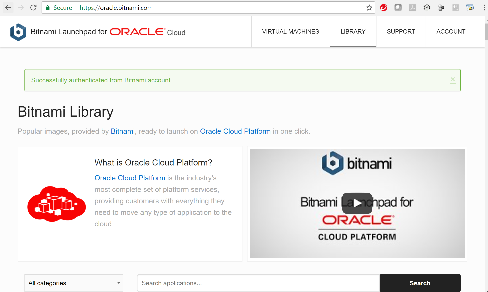

### Provision the VM

Click the Library Tab in the top right and enter **MongoDB** into the Application Search area as per the following screenshot.

Press **Search**

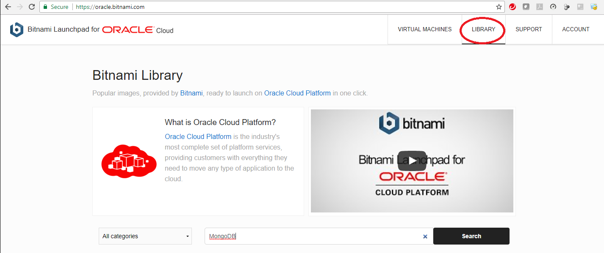

Select the **MongoDB** application image

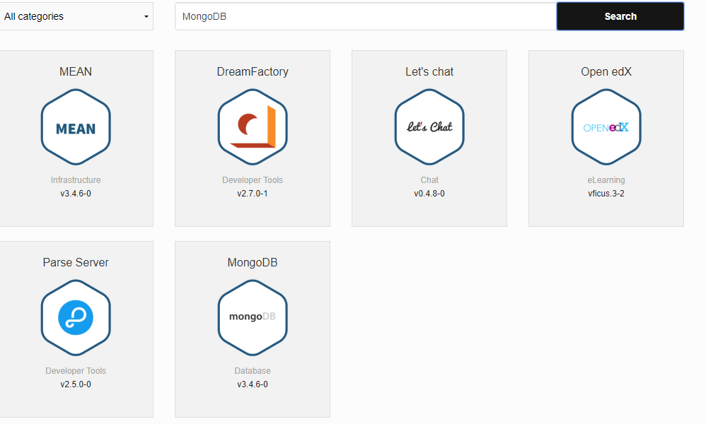

Your screen should now look something like the following screenshot.
Note: it will show your Identity Domain rather than my gseXXX reference.

Enter a meaningful name for your VM and accept the default **New security list**. That way, a public IP address will be assigned and ports 22 (ssh) and 27017 (access to MongoDB) will be opened for interactions.

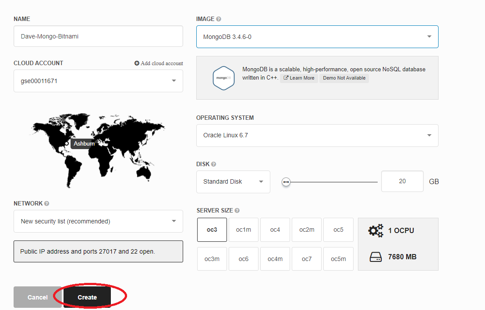

The OC3 computer shape (1 OCPU with 7.5 GB RAM) will be enough, but note how you can specify a larger CPU / memory footprint if that was necessary. As stated above - accept the defaults otherwise you will use up your Cloud Credits more quickly than necessary.

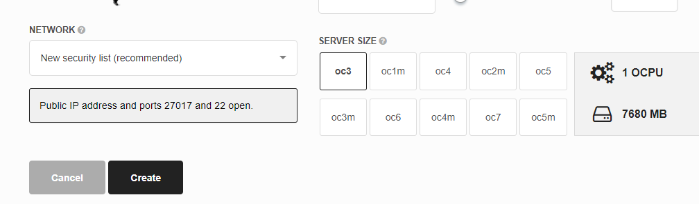

Press the **Create** button


The process to create the VM takes a few minutes.

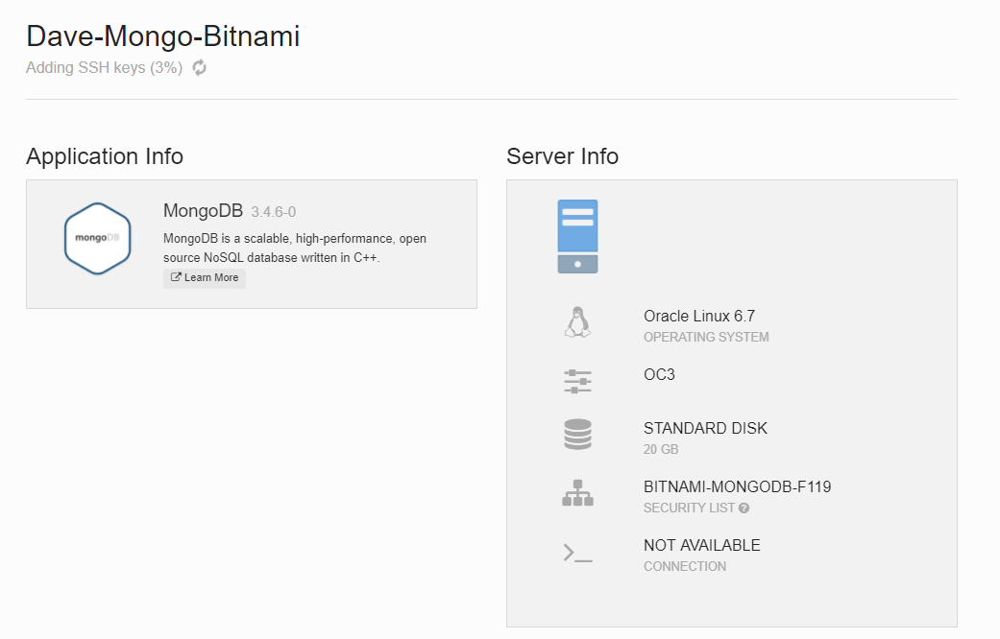

Status updates flow into the console as the provisioning of the VM on to Oracle IaaS progresses.

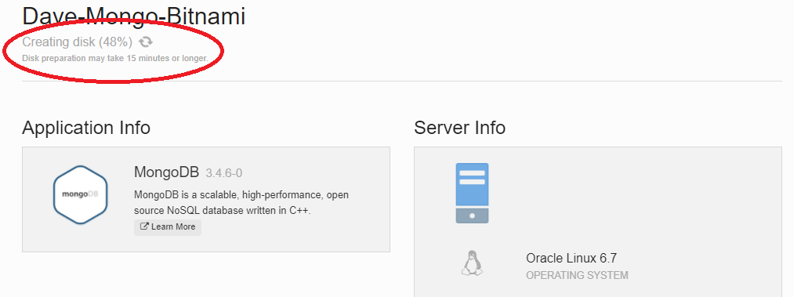

Eventually the provisioning completes and you wil see the root user password and the IP address assigned for the VM.

Note: You will need the IP address and the root password for a later step to create the MongoDB User. For this, ensure you either record the details or leave the browser tab open.

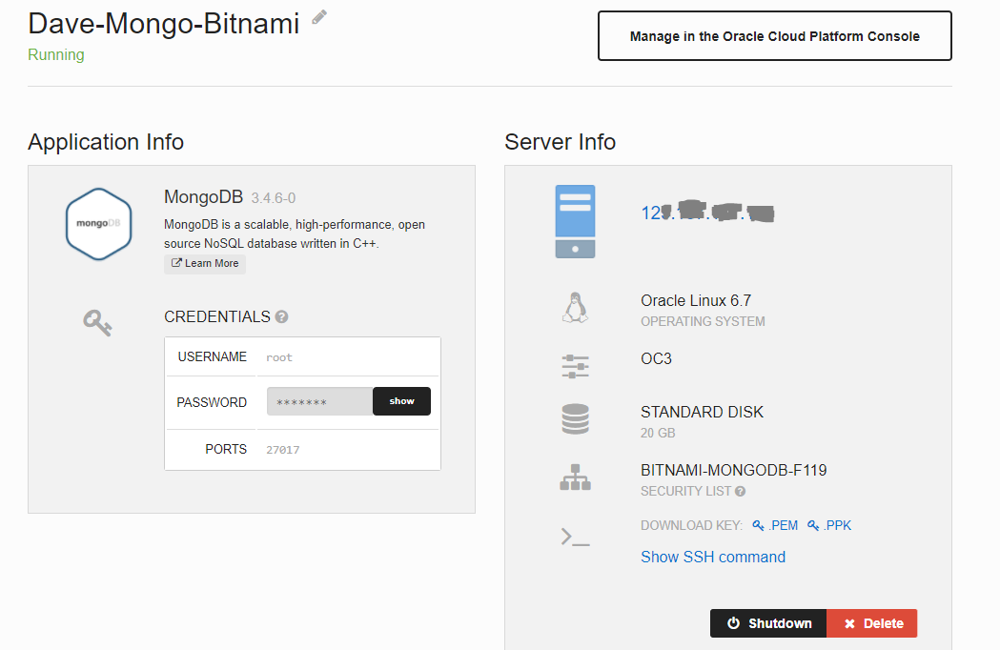

### Putty / SSH to your MongoDB VM 

We now need to create a User within MongoDB so that we add some additional security to our MongoDB environment.
In order to create the user we need to ssh connect to the running VM.

You may have noticed that:
- Private Keys are available for you to download so you can ssh / Putty connect to the VM.
- You can copy the root password by clicking on the *Show* button


*Note: If you are sshing from a command line, you can click to show the SSH command required. You will require the private (pem) key.*

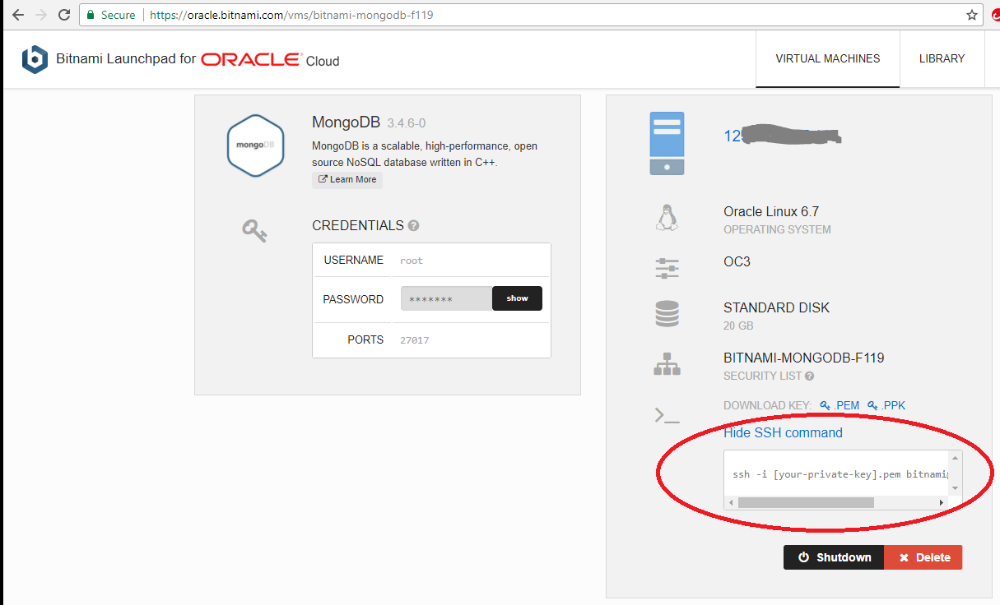

If using Putty, download the ppk file onto your local filesystem. Establish an ssh connection to the VM using the details provided.

Open Putty and enter the following in the hostname field. 
Modify to suit your IP address.
 
``` 
bitnami@YourIpAddress
```

Choose SSH from the Radio Buttons.
Set the Port to 22

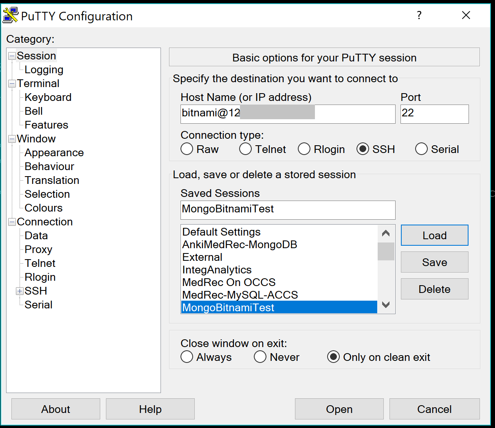

Under the Categories in the left pane, choose Auth which is located under **Connections -> SSH -> Auth**

Browse to locate your Putty private key (the **ppk** file you downloaded earlier).

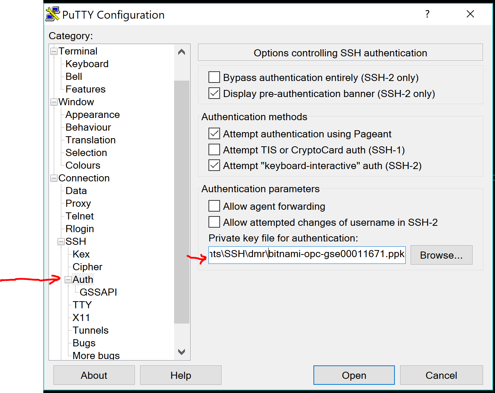

Scroll back up to the Session Category. Name your Session under the Saved Sessions field.

Then press **Save**

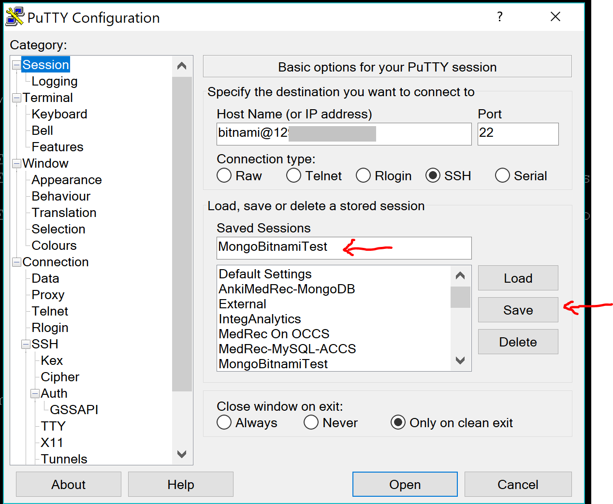

With your saved session selected, press the **Open** button to establish the SSH connection to your Bitnami VM hosted on the Oracle Cloud Infrastructure.

In the security dialog that appears, you will need to accept the host, and once the session is established.

<!--img src="./img/iaas-352.PNG" /-->

### Create a user in MongoDB

Having established an SSH connection, you can now create the MongoDB user within your MongoDB database.

<!--img src="./img/iaas-353.PNG" /-->

To create the user in the MongoDB database. The steps are as follows:

1. Open the mongo shell as the "dba user" called **admin** using the root user credentials. 

   Enter the following command - Note: Substitute the password for the root user password you were provided earlier

```
mongo admin --username root --password yourpassword
```

2. Specify the database name we want to create the user within. In our case we will use **medrec**.

```
use medrec
```

3. Specify the create of the username, password and user privileges in json format using db.createUser

Note: change the password from **mysecretpassword** to one you prefer. In this case we are also giving this user *dbAdmin* privileges, so that we can use it to exesute some admin tasks later on.

```
db.createUser(
  {
  user: "medrecuser",
  pwd: "mysecretpassword",
  roles: ["readWrite", "dbAdmin"]
  }
)
```

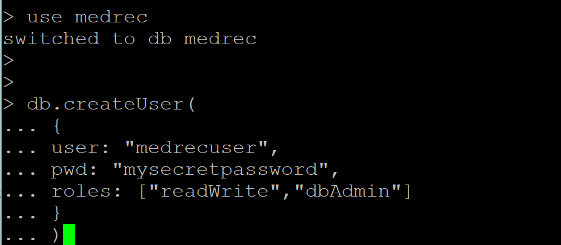

You should see a message that the user was successfully created as per the following screenshot.

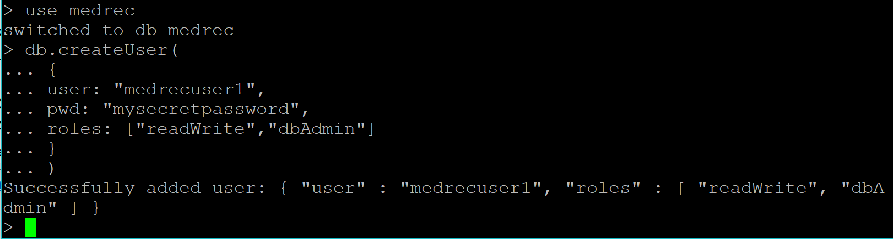

Enter **exit** to get out of Mongo client application.

Assuming all of the above worked successfully, you are now ready to do the next part of the lab, where you will provision an Application Container Cloud Service (ACCS) instance to host your Node.js API's and wire it through to interact with your freshly provisioned and configured MongoDB instance.

<br><br>

* No warranty expressed or implied.  Software is as is.
* [MIT License](http://www.opensource.org/licenses/mit-license.html)

<hr />
<center>
<a href="../../handsonlabs" class="btn" >Back to Hands On Lab Menu</a>
<center />
<hr />


