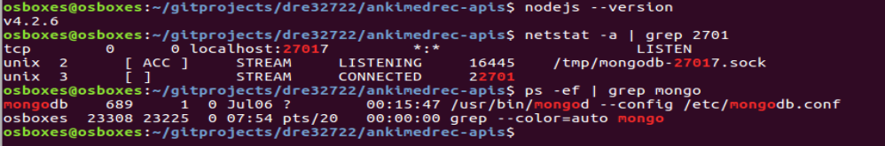
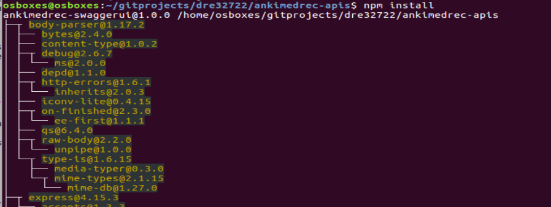
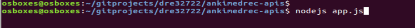
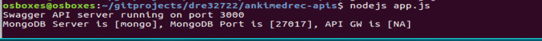

## Hands On Labs

- Oracle Code Sydney July 2017

### Run the Node APIs locally

This section provides instructions to run the node application locally on your laptop.
First ensure that MongoDB is running

Navigate to the ankimedrec-apis directory and run the following command.
This command will pull down the required library packages to support the application based on the contents of the package.json file.

*npm install*

You can ignore the npm WARN ankimedrec-swaggerui@1.0.0 No repository field message.

Next execute the command to start the node application.

*nodejs app.js* or *node app.js*

You should see that the application is running and accepting request on localhost:3000

Launch a web browser and point it to **localhost:3000**
You should see the SwaggerUI displayed as per the following screenshot.

* No warranty expressed or implied.  Software is as is.
* [MIT License](http://www.opensource.org/licenses/mit-license.html)

<a href="../../handsonlabs" class="btn" >Back to Hands On Lab Menu</a>

