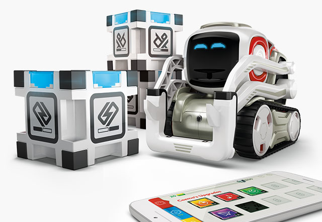

## The Anki-MedRec Platform

- a System of Record (Avitek- MedRec) to act as a discussion point around Systems of Record, and the need to differentiate and innovate outside of the Systems of Record.
- some basic CRUD APIs against MedRec to provide a starting point upon which participants can bring their innovative ideas to explore and prove.

The Anki-MedRec will serve as a vehicle to overlay innovative ideas and implement them using various Cloud Services (IaaS, PaaS, SaaS) and Open Source software. We hope that it will encourage learning and innovation from a number of perspectives whether you are running a workshop, running a conference, a hackathon or just self-learning around the following areas:

- APIs
- Containers
- Mobility, Chatbots, Robotics (including Cozmo from Anki)

 

So by now you have already worked it out, we have developed the API's to help us to get to do some creative, fun, learning real fast.

### Check out the brief Overview Video:

<iframe width="854" height="480" src="https://www.youtube.com/embed/MDGg1r9CtCw?rel=0" frameborder="0" allowfullscreen></iframe>

### Who is this for?

The MedRec Platform Playpen supports a diverse range of users and activities, such as:

-	Managers walking through functional demonstrations of a Digital Platform
-	Developers participating in Hackathons
-	University Students
-	Community Involvement - essentially anyone who is interested in improving their understanding of what makes a Cloud Based Digital Platform.

### Get Started with AnkiMedRec-APIs

The AnkiMedRec version 2 APIs are based on Node.js and interact with MongoDB as the datastore.
The quickest way to get started is to click the Get Started link below. 

[Get Started With APIs in Less Than 5 Minutes](fivetoapis.md)|[Register to access the APIs](http://developers.oracleau.cloud) | [Comprehensive HandsOn Tutorials](handsonlabs.md) | [Hackathons](hackathons.md) | [Additional Video Tutorials](videos.md) | 
 

If you want to preserve the data you create then all you need to do is register as a developer by providing a username and password and you will be provided an API key.  You can then follow the hands on tutorials to do all / any of the following;

1. Access the APIs hosted on the Oracle Cloud protected by the Oracle API Platform Cloud Service.
2. Setup your local development environment with Node.js, MongoDB and Docker 
3. Run the APIs on your laptop
4. Run the APIs inside a local Docker container
5. Run the APIs inside a Docker Container provided by the Oracle Container Cloud Service 

### Accessing the APIs using your API Key 

<iframe width="854" height="480" src="https://www.youtube.com/embed/9ra_guIjce8?rel=0" frameborder="0" allowfullscreen></iframe>

### Where could this go? Community Involvement:

The Node.js API's are a place to start, a beginning. We have created something that we know isn't perfect or particularly robust but the APIs seem to be functional. For instance. you can add Physicians,Patients, create prescriptions and record Observations. We know that there are lots of smart people out there who like to explore, experiment and improve things, so if you are interested, why not fork the git repository and start with your idea to improve. 

You may decide to add more capability into the API implementation, or add additional APIs or maybe you want to connect a wearable device or an Anki-Cozmo robot to interact with the APIs. 

### Cozmo Gets A Cold

<iframe width="854" height="480" src="https://www.youtube.com/embed/leOZ1fUTFeE?rel=0" frameborder="0" allowfullscreen></iframe>

 If you are interested in contributing, please contact [Franco Ucci](franco.ucci@oracle.com) | [Ali Mukadam](ali.mukadam@oracle.com) | [Jason Lowe](jason.lowe@oracle.com) | [David Reid](david.m.reid@oracle.com) | [Carlos Rodriguez Iturria](https://www.linkedin.com/in/citurria/)

